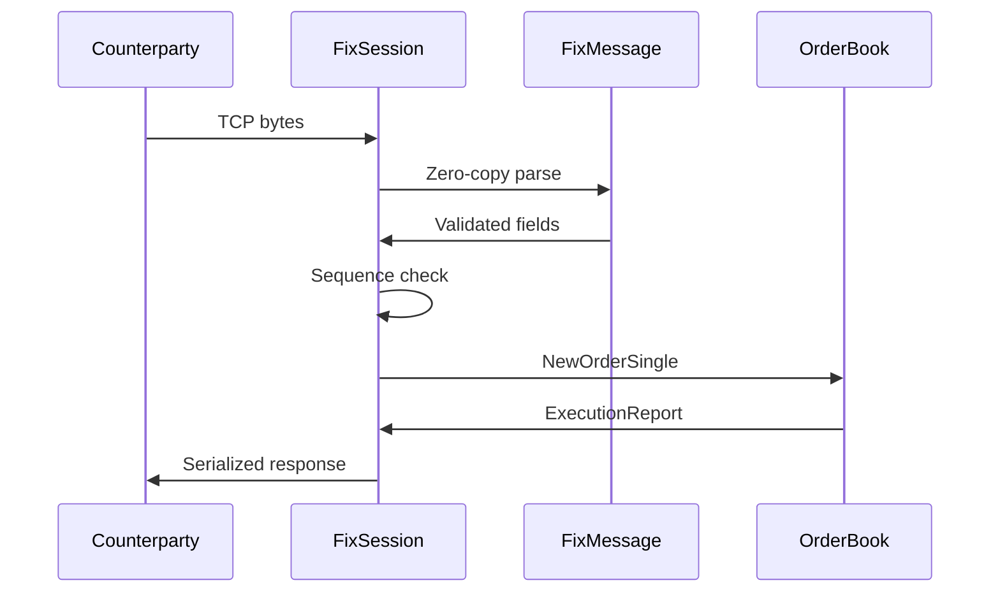

# Architecture: FIX Protocol Engine

## Design Constraints
- **Zero allocation** on parsing path
- **Wire-speed throughput** (>1M msgs/sec single core)
- **Fuzzing-hardened** against malformed input
- **FIX 4.4 compliant** with session layer state machine

## System Architecture

## Architectural Decision Records

ADR-001: Zero-Copy Parsing

Decision: FixMessage wraps string_view into raw buffer. No field extraction copies.
Rationale: Avoids heap allocation in hot path. Enables cache-line friendly processing.

ADR-002: Compile-Time Tag Resolution

Decision: TagType<Tag> templates resolve field types at compile time.
Rationale: Eliminates runtime type dispatch. Compiler can inline entire parse chain.

ADR-003: Checksum as First Validation

Decision: validateChecksum() available before any field extraction.
Rationale: Detects corrupted messages before expensive parsing. Industry standard defense.

ADR-004: Fuzzing Harness

Decision: LibFuzzer integration exercises all parser code paths with malformed input.
Rationale: OWASP requirement for network-facing parsers in financial systems.
